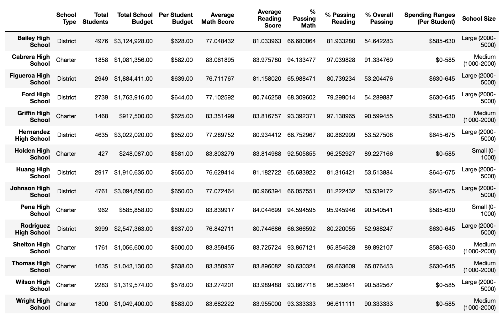

# School District Analysis
The school board has notified Maria and her supervisor that the ```students_complete.csv``` file shows evidence of academic dishonesty; specifically, reading and math grades for Thomas High School ninth graders appear to have been altered. 
Although the school board does not know the full extent of the academic dishonesty, they want to uphold state-testing standards and have turned to Maria for help. She has asked you to replace the math and reading scores for Thomas High School with NaNs while keeping the rest of the data intact. Once you’ve replaced the math and reading scores, Maria would like you to repeat the school district analysis that you did in this module and write up a report to describe how these changes affected the overall analysis.

## Results

### District Summary

Naturally after dropping some data from the Thomas High School with NaNs we expect our data to be different. What we noticed is that there were only slight changes in the district summary. 

* The Average Math Score dropped from 79 to 78.9
* The % of students passing math dropped from 75% to 74.8%
* The % of students passing reading dropped from 86% to 85.7%
* The overall percentage of students passing only dropped by 0.1% to 64.9%

### School Summary
Before we had made changes as per Maria's request. Thomas High School (THS) was one of the more promising schools with 91% of their students passing (overall). This meant THS would place second of all schools ranked on % Overall Passing

After cleaning up the file THS dropped to 8th place. This is due to making 9th grade math scores NaNs, which effectively is equal to zero. 



### Summary
* Removing the THS 9th Grade results lowers the % Passing Math, % Passing Reading and % Overall Passing for their spending range between $630-$645
* Removing the data also reduces the "Charter Type" % Passing Math, % Passing Reading and % Overall Passing as THS is a charter type
* Additionally it also reduces the Medium size % Passing Math, % Passing Reading and % Overall Passing as THS is a charter type

